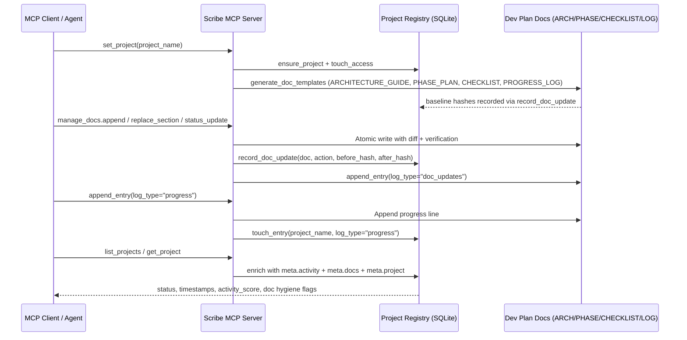

# Scribe MCP Whitepaper v2.1

## What's New in v2.1

**Major Enterprise Enhancements**

Scribe MCP v2.1 represents a significant evolution from v2.0, introducing six major feature areas that transform the platform from a sophisticated logging system into a comprehensive documentation governance platform with enterprise-grade capabilities.

### 🎯 Agent Report Cards System
- **Performance Grading Infrastructure**: Comprehensive agent performance evaluation with UPSERT operations and quality metrics tracking
- **Automated Quality Assessment**: Performance levels and grading system with structured metadata storage
- **Cross-Agent Analytics**: Organizational insights into agent effectiveness and workflow optimization
- **Implementation**: `storage/base.py:78-90` and `storage/sqlite.py:266-303`

### 🔧 Advanced Jinja2 Template Engine
- **Security Sandboxing**: ImmutableSandboxedEnvironment with 22 restricted builtins for secure template execution
- **Template Discovery Hierarchy**: Automatic discovery across base, project-specific, and custom template directories
- **Real-Time Rendering**: Live template validation and syntax checking with comprehensive error reporting
- **Inheritance Support**: Template composition and inheritance patterns for reusable documentation
- **Implementation**: `template_engine/engine.py:103-150`

### 🔍 Phase 4 Enhanced Search Capabilities
- **Cross-Project Validation**: Organizational-wide search with project isolation and global analytics
- **Relevance Scoring**: Advanced relevance scoring (0.0-1.0) with intelligent result ranking
- **Code Reference Verification**: Automatic validation that referenced code actually exists in the codebase
- **Advanced Filtering**: Search scope modes (6 types), document types (5 categories), and temporal filtering
- **Implementation**: `tools/query_entries.py:46-80`

### 🛡️ Write-Ahead Logging System
- **Bulletproof Crash Recovery**: Journal-based operations with automatic replay capabilities
- **Atomic Operations**: Entry IDs using timestamp+hash for unique identification and integrity
- **Commit/Rollback Mechanisms**: Transactional operations with fsync guarantees
- **Performance Optimization**: Efficient batch operations and integrity verification
- **Implementation**: `utils/files.py:158-229`

### 🤖 Claude Code Subagents Integration
- **Structured Research Workflows**: Automated research document creation with template-based generation
- **Bug Report Generation**: Automated bug reporting with structured templates and automatic indexing
- **Template Management**: 18+ specialized templates with validation and sanitization
- **Workflow Automation**: Research → Architecture → Review → Code → Review protocol implementation
- **Implementation**: `tools/manage_docs.py:568-624`

### 🏗️ Modern Tool Architecture
- **BaseTool Classes**: Unified base classes with parameter normalization and consistent error handling
- **Standardized Responses**: ToolResult format providing consistent MCP tool infrastructure
- **Modular Design**: Clean separation of concerns and reusable tool patterns
- **Enhanced Error Management**: Comprehensive error handling and graceful degradation
- **Implementation**: `tools/base/base_tool.py:13-60` and `tools/base/tool_result.py:8-50`

### 📊 Enhanced Infrastructure
- **Comprehensive Testing**: 236 tests across 28 test files providing enterprise-grade reliability
- **Token Estimation System**: Tiktoken integration for performance optimization and cost management
- **Multi-Backend Storage**: Enhanced SQLite and PostgreSQL support with connection pooling
- **Security Framework**: Repository-based access control and path validation systems

**v2.1 transforms Scribe MCP from a logging tool into a comprehensive documentation governance platform ready for enterprise deployment.**

---

## Executive Summary
Scribe MCP is a production-ready Model Context Protocol (MCP) server that provides agentic systems with a disciplined, auditable workflow for documenting software projects. It has evolved from a simple progress logging system into a comprehensive documentation governance platform with enterprise-grade features including atomic operations, integrity verification, template engines, and advanced audit trails.

Scribe extends the traditional "append-only progress log" into a full documentation lifecycle management system: every meaningful action is captured, cross‑referenced with living architecture/phase plans, and reinforced through a sophisticated reminder engine that maintains synchronization between implementation and planning. As the flagship resident of the `MCP_SPINE` ecosystem, Scribe demonstrates the power of modular MCP architecture.

**Core Capabilities:**
- **Atomic Document Management** via `manage_docs` with real-time template rendering and diff verification
- **Bulletproof Logging System** with single/bulk entry modes, structured metadata, and Write-Ahead Log crash recovery
- **Advanced Template Engine** (Jinja2-based) with sandboxing, inheritance, and custom template discovery
- **Enterprise Audit Trails** with integrity verification, rotation chains, and comprehensive metadata
- **Multi-Backend Storage** supporting SQLite (zero-config) and PostgreSQL (team deployments)
- **Intelligent Reminder Governance** with dynamic scoring, drift detection, and workflow enforcement
- **Comprehensive Search & Analytics** with exact/substring/regex matching and temporal filtering
- **Production-Ready Operations** including atomic writes, file locking, cross-platform compatibility, and preflight backups
- **Project Registry & Lifecycle Tracking** via a SQLite-backed registry (`scribe_projects`) that exposes status, timestamps, counters, activity metrics, and doc hygiene state for every project

**Recent Major Enhancements:**
- **Enhanced Log Rotation** with hash chains, sequence numbers, and integrity verification
- **Multi-Log Support** via configurable routing (progress, doc_updates, security, bugs)
- **Advanced Query System** supporting exact message matching and case-sensitive filtering
- **Template Engine Integration** enabling real-time document updates with validation
- **Crash-Resilient Operations** through Write-Ahead Logging and atomic file operations
- **Performance Optimizations** with bulk operations, caching, and async throughput

This whitepaper documents the production-ready architecture, operational workflows, configuration patterns, and enterprise features that make Scribe MCP the definitive solution for agentic documentation governance.

---

## Architectural Overview

```
MCP_SPINE/
  └── scribe_mcp/
        ├── server.py                    # MCP server with graceful degradation
        ├── config/                      # Configuration and settings management
        │   ├── settings.py              # Environment-based configuration
        │   ├── log_config.py            # Multi-log routing configuration
        │   └── repo_config.py           # Repository-level settings
        ├── state/                       # State management and persistence
        │   ├── manager.py               # Project state and session tracking
        │   └── agent_manager.py         # Agent identity and context management
        ├── storage/                     # Multi-backend storage abstraction
        │   ├── base.py                  # Storage interface definition
        │   ├── sqlite.py                # Zero-config SQLite backend
        │   ├── postgres.py              # Team-scale PostgreSQL backend
        │   └── models.py                # Data models and schemas
        ├── template_engine/             # Advanced Jinja2 template system
        │   ├── engine.py                # Sandboxed template rendering
        │   ├── cli.py                   # Template CLI utilities
        │   └── validation.py            # Template syntax validation
        ├── tools/                       # MCP tool implementations
        │   ├── project_management/      # Project lifecycle tools
        │   ├── documentation/           # Document management tools
        │   ├── logging/                 # Logging and analytics tools
        │   └── utilities/               # Helper and maintenance tools
        ├── utils/                       # Core utilities and helpers
        │   ├── files.py                 # Atomic file operations & WAL
        │   ├── integrity.py             # File integrity and hashing
        │   ├── audit.py                 # Audit trail management
        │   ├── rotation_state.py        # Log rotation state tracking
        │   ├── search.py                # Text search and filtering
        │   └── time.py                  # Timezone-aware utilities
        ├── security/                    # Security and sandboxing
        │   └── sandbox.py               # Path validation and access control
        ├── doc_management/              # Document lifecycle management
        │   └── manager.py               # Structured document operations
        ├── reminders.py                 # Intelligent reminder engine
        └── templates/                   # Jinja2 template library
            ├── base/                    # Core template definitions
            ├── projects/                # Project-specific templates
            └── custom/                  # User-defined templates
```

### Environment Configuration & External Repos
- **SCRIBE_ROOT**: Absolute path to the project root where `docs/dev_plans/<project>/...` lives. Set this when running Scribe against any repo outside `MCP_SPINE`.
- **SCRIBE_STATE_PATH**: Writable JSON state file (per-user or per-repo). Defaults to `~/.scribe/state.json`; override for isolated test runs.
- **Optional storage envs**: `SCRIBE_STORAGE_BACKEND` (`sqlite` | `postgres`) and `SCRIBE_DB_URL` for Postgres deployments.
- **PYTHONPATH**: Include the parent of `scribe_mcp` when launching from other repos so imports resolve.
- **.env loading**: Scribe now best-effort auto-loads `.env` via `python-dotenv` on startup; shell/process manager exports still work as usual.
- **Overlap detection**: Root overlaps are tolerated when progress logs/docs differ (e.g., many dev_plan folders under one repo). Actual collisions on `progress_log` or `docs_dir` remain guarded.

### MCP Server Core (`MCP_SPINE/scribe_mcp/server.py`)
- Boots a stdio-based MCP server using the official `mcp` Python SDK when available (falls back to a permissive stub if the SDK is missing for local testing).
- Registers all tools under a single `Server` instance. During import it dynamically adds `@app.tool` support if the SDK version lacks the helper decorators (maintaining compatibility with older SDKs).
- Manages server lifecycle hooks (`setup`, `close`), delegating to the active storage backend.
- Exposes global singletons:
  - `state_manager`: orchestrates persistent state.
  - `storage_backend`: chosen at startup (SQLite by default, Postgres when configured).

### Configuration Layer (`config/settings.py`)
- Parses environment variables with fallbacks for repository discovery (`SCRIBE_ROOT`, `SCRIBE_STATE_PATH`).
- Determines storage backend selection (`SCRIBE_STORAGE_BACKEND`, `SCRIBE_DB_URL`).
- Sets operational limits (log rotation size, rate limiting, reminder defaults).
- Exposes reminder tuning knobs (tone, severity weights, idle reset thresholds) via `Settings.reminder_defaults`.

### State Manager (`state/manager.py`)
- Reliable JSON-backed state file supporting:
  - Current project selection and metadata cache (`config/projects/*.json`).
  - Rolling history of the last 10 tool invocations, each with timestamp—feeds reminder cadence.
  - Session tracking (`session_started_at`, `last_activity_at`) to detect restarts and idle thresholds.
  - Atomic updates (`record_tool`, `set_current_project`, `update_project_metadata`) guarded by an `asyncio.Lock` for safe concurrent access.
- Normalizes tool history entries to ensure backwards compatibility as state evolves.

### Storage Backends (`storage/`)
- **SQLite backend** (`sqlite.py`): 
  - On-demand connections with busy timeout.
  - Mirrored schema (projects, entries, metrics) for local-first deployments.
  - JSON meta storage and timestamp indexes for fast queries.
- **Postgres backend** (`postgres.py`): 
  - Asyncpg pool management.
  - Utilizes SQL helpers in `db/ops.py` for upsert, insert, and query operations.
- Both backends implement the `StorageBackend` interface defined in `storage/base.py` to keep tool logic backend-agnostic.

### Reminder Engine (`reminders.py`)
- Central governance unit producing structured reminders for every tool response.
- Features:
  - **Severity scoring**: default weight mapping (info/warning/urgent) promoted to dynamic scoring (1–10). Sessions in “warmup” mode downgrade warnings to informational until the team settles back in.
  - **Tone customization**: `defaults.reminder.tone` allows neutral, friendly, direct, or custom voices without code changes.
  - **Doc drift detection**: stores SHA-1 hashes per doc; diffs highlight changed artifacts and outdated content (e.g., architecture guide, phase plan).
  - **Staleness checks**: timezone-aware comparisons guard against missing UTC offsets.
  - **Workflow enforcement**: warns when development proceeds before architecture/phase/checklist are in acceptable states.
  - **Context reminder**: ensures every reply identifies the active project, log counts, and session age.

### Agent Report Cards System (`storage/`)
**Enterprise-Grade Performance Grading Infrastructure**
- **Performance Tracking**: Comprehensive agent performance evaluation with structured data collection
- **Quality Metrics**: Automated assessment system with performance levels and grading infrastructure
- **UPSERT Operations**: Atomic data operations ensuring consistency and integrity of performance data
- **Cross-Agent Analytics**: Organizational insights into agent effectiveness and workflow optimization
- **Metadata Storage**: Rich metadata support for detailed performance analysis and reporting
- **Implementation**: `storage/base.py:78-90` (interface definition) and `storage/sqlite.py:266-303` (SQLite implementation)

**Technical Architecture:**
The Agent Report Cards system provides a sophisticated infrastructure for tracking and evaluating agent performance across all Scribe MCP operations. The system implements a standardized interface for recording agent evaluations, including file_path, agent_name, stage, overall_grade, performance_level, and comprehensive metadata.

**Key Features:**
- **Structured Data Model**: Standardized fields for consistent performance tracking across all agent types
- **Atomic Operations**: UPSERT-style operations prevent data duplication and ensure integrity
- **Multi-Backend Support**: Works seamlessly with both SQLite and PostgreSQL storage backends
- **Query Capabilities**: Rich querying interface for performance analytics and reporting
- **Audit Trail**: Complete audit trail of all performance evaluations and grade changes

### Template Engine (`template_engine/`)
**Advanced Jinja2 Integration with Enterprise-Grade Security**
- **Multi-Tier Security Sandboxing**: ImmutableSandboxedEnvironment and SandboxedEnvironment with configurable security modes
- **22 Restricted Builtins**: Comprehensive security controls with safe function whitelist (abs, bool, dict, enumerate, float, etc.)
- **Template Discovery Hierarchy**: Automatic discovery across base → project-specific → custom template directories
- **Real-Time Validation**: Live syntax checking and comprehensive error reporting before template application
- **Advanced Inheritance**: Template inheritance and composition patterns with `` and `` support
- **Security Modes**: Three-tier security system (immutable, sandbox, disabled) for different trust levels
- **Custom Variables**: JSON-based variable injection with `.scribe/variables.json` support
- **Template Packs**: Support for custom template packs and legacy template fallback
- **Implementation**: `template_engine/engine.py:103-150` (Jinja2TemplateEngine class)

**v2.1 Security Enhancements:**
- **ImmutableSandboxedEnvironment**: Most restrictive mode preventing any mutable operations
- **Path Validation**: Secure template loading with repository-based access controls
- **Input Sanitization**: Automatic sanitization of template inputs and variables
- **Error Handling**: Comprehensive error reporting with security-conscious error messages

**Technical Architecture:**
The v2.1 template engine provides enterprise-grade security with multiple sandboxing modes while maintaining flexibility for legitimate template operations. The system supports both modern Jinja2 patterns and legacy variable substitution for backward compatibility.

### Document Management (`doc_management/`)
**Atomic Document Operations with Verification**
- **Structured Updates**: `replace_section`, `append`, `status_update` operations with validation
- **Diff Verification**: Before/after diff generation and change verification
- **Atomic Writes**: Template rendering and file updates in single atomic operations
- **Change Tracking**: Automatic logging of all document changes to audit trails
- **Template Integration**: Seamless integration with Jinja2 template engine for dynamic content

### 🤖 Claude Code Subagents Integration (`tools/manage_docs.py`)
**Structured Workflows and Automated Reporting**
- **Research Document Creation**: Automated research document generation with template-based structure and validation
- **Bug Report Generation**: Structured bug reporting with automatic indexing, categorization, and sanitization
- **Template Management**: 18+ specialized templates for research, bugs, reviews, and agent report cards
- **Workflow Automation**: Complete Research → Architecture → Review → Code → Review protocol implementation
- **Automatic Indexing**: Dynamic index updates for research documents and bug reports across projects
- **Content Sanitization**: Filesystem safety and content validation for all generated documents
- **Metadata Management**: Rich metadata support for document categorization and discovery
- **Implementation**: `tools/manage_docs.py:568-624` (special document creation workflows)

**v2.1 Subagent Architecture:**
The Claude Code Subagents integration provides structured workflows for systematic research, bug tracking, and documentation management. The system supports automated creation of research documents with executive summaries, technical analysis, and recommendations, plus comprehensive bug reporting with categorization and automatic indexing.

**Key Subagent Features:**
- **Research Workflows**: Template-based research document creation with structured sections and validation
- **Bug Reporting**: Automated bug report generation with category-based organization and indexing
- **Review System**: Structured review documents for quality assurance and agent evaluation
- **Agent Report Cards**: Performance tracking and grading system for agent evaluation
- **Template Library**: 18+ specialized templates supporting different document types and workflows

### Bulletproof File Operations (`utils/files.py`)
**Enterprise-Grade File Reliability with Write-Ahead Logging**
- **Write-Ahead Logging (WAL)**: Journal-based operations with automatic crash recovery and replay
- **Entry ID System**: Unique identifiers using timestamp+hash for operation tracking and integrity
- **Commit/Rollback Mechanisms**: Transactional operations with fsync guarantees and atomic commits
- **Atomic Operations**: Write-temp-rename pattern for atomic file updates with verification
- **Cross-Platform Locking**: File locking with Windows, macOS, and Linux support
- **Integrity Verification**: SHA-256 hashing and corruption detection systems
- **Preflight Backups**: Automatic backups before risky operations with rollback capability
- **Async Operations**: Non-blocking file operations for performance optimization
- **Implementation**: `utils/files.py:158-229` (WriteAheadLog class and crash recovery)

**v2.1 WAL Architecture:**
The Write-Ahead Logging system provides bulletproof crash recovery through journal-based operations. Every operation is first written to a journal file with unique entry IDs (timestamp+hash), then applied to the target file. On system startup, any uncommitted operations are automatically replayed, ensuring no data loss even after crashes or power failures.

**Key WAL Features:**
- **Journal-Based Recovery**: All operations journaled before execution with automatic replay on startup
- **Transactional Integrity**: ACID-like properties with commit/rollback semantics
- **Performance Optimization**: Batch operations and efficient journal management
- **Crash Resilience**: Complete recovery from system crashes, power failures, and process termination

### 🏗️ Modern Tool Architecture (`tools/base/`)
**Unified Base Classes and Standardized Responses**
- **BaseTool Abstract Class**: Unified infrastructure for all Scribe MCP tools with consistent patterns
- **Parameter Normalization**: Automatic parameter validation, type conversion, and sanitization across all tools
- **Standardized Error Handling**: Consistent error responses and graceful degradation patterns
- **ToolResult Format**: Standardized response structure providing consistent MCP tool infrastructure
- **State Management Integration**: Seamless integration with state manager and storage backends
- **MCP Protocol Compliance**: Automatic tool registration and lifecycle management
- **Metadata Management**: Tool metadata handling for discovery and documentation
- **Implementation**: `tools/base/base_tool.py:13-60` (BaseTool class) and `tools/base/tool_result.py:8-50` (ToolResult format)

**v2.1 Architecture Benefits:**
The Modern Tool Architecture provides a unified foundation for all Scribe MCP tools, ensuring consistent behavior, error handling, and response formatting across the entire tool suite. This architecture enables rapid development of new tools while maintaining enterprise-grade reliability and usability.

**Key Architecture Features:**
- **Consistent Interface**: All tools inherit from BaseTool ensuring uniform parameter handling and responses
- **Error Resilience**: Standardized error handling with graceful degradation and informative error messages
- **Developer Experience**: Predictable patterns and utilities for tool development and maintenance
- **Quality Assurance**: Built-in validation and testing infrastructure for all tools
- **Extensibility**: Clean abstractions enabling easy addition of new tools and capabilities

### Enhanced Tool Suite (`tools/`)
**Project Management:**
- `set_project`: Project creation, template generation, and state initialization with temp project detection
- `get_project`: Current project context with document integrity hashes and metadata
- `list_projects`: Complete project inventory with full metadata and recent project tracking
- `generate_doc_templates`: Template generation with customization options and overwrite handling

**Document Management:**
- `manage_docs`: Atomic document updates with real-time template rendering and diff verification
- Structured operations: `replace_section`, `append`, `status_update` with validation
- Automatic change tracking and audit logging via doc_updates log

**Advanced Logging System:**
- `append_entry`: Single/bulk entry modes with comprehensive metadata and auto-splitting
- Multi-log routing support (progress, doc_updates, security, bugs) via log_config.json
- Structured metadata with key=value pairs, JSON support, and automatic validation
- Enhanced emoji and status handling with timezone-aware timestamp generation

**Analytics & Phase 4 Enhanced Search:**
- `read_recent`: Configurable entry limits (n parameter fix) with agent/status filtering
- `query_entries`: Phase 4 enhanced search with cross-project validation and relevance scoring
- **6 Search Scope Modes**: project, global, all_projects, research, bugs, all for organizational search
- **5 Document Types**: progress, research, architecture, bugs, global for precise content targeting
- **Relevance Scoring**: Advanced relevance scoring (0.0-1.0) with intelligent result ranking and filtering
- **Code Reference Verification**: Automatic validation that referenced code actually exists in the codebase
- **Temporal Filtering**: Time range filters (last_30d, last_7d, today) for period-based analysis
- **Cross-Project Analytics**: Organizational-wide search with project isolation and global insights
- **Implementation**: `tools/query_entries.py:46-80` (enhanced search parameters and validation)

**Log Management:**
- `rotate_log`: Enhanced rotation with integrity verification, hash chains, and sequence numbers
- Comprehensive audit trails with rotation metadata and archival integrity verification
- Configurable archive naming, rotation policies, and pre-flight backup systems

**System Health:**
- `health_check`: System health verification and connectivity testing
- Enhanced error handling, graceful degradation, and comprehensive status reporting

### Project Registry & Lifecycle (`shared/project_registry.py`, `tools/list_projects.py`)

Scribe includes a **SQLite-backed Project Registry** that turns projects into first-class, queryable entities:

- **Registry Table (`scribe_projects`, SQLite-first)**:
  - Fields (conceptual): `id`, `name`, `description`, `status`, `created_at`, `last_entry_at`, `last_access_at`, `last_status_change`, `tags`, `meta`.
  - Lifecycle states: `planning | in_progress | blocked | complete | archived | abandoned`.
  - Backed by the existing `SQLiteStorage` and automatically extended via `_ensure_schema` (no destructive migrations).
- **Integration Hooks**:
  - `set_project`:
    - Ensures a `scribe_projects` row exists for each logical project.
    - Populates dev_plan rows for core docs (`architecture`, `phase_plan`, `checklist`, `progress_log`).
    - Updates `last_access_at` on each selection.
  - `append_entry`:
    - For `log_type="progress"`, calls `ProjectRegistry.touch_entry`, which updates `last_entry_at` and can auto‑promote `status` from `planning` → `in_progress` once core docs exist and at least one progress entry has been written.
  - `manage_docs`:
    - Calls `ProjectRegistry.record_doc_update` after successful doc writes, recording:
      - `meta.docs.last_update_at`, `last_doc_type`, `last_action`, `update_count`.
      - `baseline_hashes[doc]` and `current_hashes[doc]` per doc type.
      - Derived flags like `architecture_touched`, `phase_plan_modified`, `docs_started`, `docs_ready_for_work`.
- **Runtime Meta Enrichment (`get_project` / `list_projects`)**:
  - `meta.activity` (computed at read time, not stored):
    - `project_age_days`
    - `days_since_last_entry`
    - `days_since_last_access`
    - `staleness_level` (`fresh|warming|stale|frozen`)
    - `activity_score` — scalar score combining recency, entry rate, doc readiness, and optional `meta.project.priority`.
  - `meta.project`:
    - Container for project-level metadata (e.g., `owner`, `priority`, `domain`, `work_blockers`).

### Dev Plan Doc Flow (End-to-End Sequence)

Scribe’s dev-plan pipeline follows a fixed, auditable sequence that ties MCP tools, templates, and the registry together:



This flow is the canonical reference for how `set_project`, `generate_doc_templates`, `manage_docs`, and `append_entry` interact with the Project Registry and dev_plan documents. For template-level context details, see `docs/TEMPLATE_VARIABLES.md`.

### Licensing & Distribution

Scribe MCP is distributed as **source-available infrastructure** under the **Scribe MCP License (Community + Small Business License)**:

- Free for:
  - Individual developers and open-source contributors
  - Researchers and educational use
  - Small teams and small businesses (under 25 employees and under \$1M USD annual revenue) **not** selling or hosting Scribe MCP as a paid product or service.
- Commercial license required for:
  - Larger organizations
  - Any SaaS, platform, or internal tooling where Scribe MCP (or derivatives) powers a paid offering.

See `LICENSE` for the full legal text and `LICENSE_HISTORY.md` for details on earlier MIT-licensed snapshots. For enterprise licensing, contact **licensing@cortalabs.com**.
  - `meta.docs.flags`:
    - Per-doc flags: `architecture_touched`, `architecture_modified`, etc.
    - Aggregate flags: `docs_started`, `docs_ready_for_work`, `doc_drift_suspected`.
    - Drift metrics: `doc_drift_days_since_update`, `drift_score` (scalar representing how out-of-date docs are versus the log).

**Enhanced `list_projects` Tool Surface**

- Arguments:
  - `limit: Optional[int] = 5`
  - `filter: Optional[str] = None` (name substring)
  - `compact: bool = False`
  - `fields: Optional[List[str]] = None`
  - `include_test: bool = False`
  - `page: int = 1`
  - `page_size: Optional[int] = None`
  - `status: Optional[List[str]] = None` (lifecycle filter)
  - `tags: Optional[List[str]] = None` (contains-any tag filter)
  - `order_by: Optional[str] = None` (`created_at|last_entry_at|last_access_at|total_entries`)
  - `direction: str = "desc"` (`asc|desc`)
- Behavior:
  - Merges storage-backed projects and state-managed projects.
  - Enriches each with Project Registry data, including `meta.activity` and `meta.docs`.
  - Applies name, status, and tag filters.
  - Normalizes timestamps to UTC-aware datetimes when ordering to avoid naive/aware comparison errors.
  - Supports both compact and full-field responses via `fields` + `COMPACT_FIELD_MAP`.

**Doc Hygiene & Drift Governance**

The registry’s doc-aware meta enables concrete doc-hygiene enforcement:

- Core concepts:
  - **Template vs. Real Docs**:
    - `baseline_hashes[doc]` captures the first non-empty hash of a template before a real edit.
    - `current_hashes[doc]` tracks the latest applied content.
    - `*_touched` and `*_modified` flags are derived automatically.
  - **Readiness**:
    - `docs_started` — at least one core doc has been touched.
    - `docs_ready_for_work` — architecture, phase plan, and checklist have all been touched.
  - **Drift**:
    - `doc_drift_suspected` — raised when:
      - Status is `in_progress` or `complete`, and
      - Docs are not ready, or
      - `last_entry_at` substantially post-dates `last_update_at`.
    - `doc_drift_days_since_update` — numeric delta in days.
    - `drift_score` — scalar used to rank how badly a project’s docs lag its logs.

These signals are exposed via `list_projects(fields=["name","status","meta"])` so orchestrators and future agents can decide:
- Which projects to prioritize.
- Which projects require doc hygiene sweeps before additional work.

### Enterprise Utilities (`utils/`)
**Production-Grade Infrastructure Components**
- `files.py`: Bulletproof atomic operations with Write-Ahead Logging, cross-platform locking, and integrity verification
- `integrity.py`: SHA-256 hashing, file verification, and corruption detection systems
- `audit.py`: Comprehensive audit trail management with metadata storage and retrieval
- `rotation_state.py`: Log rotation state tracking with hash chains and sequence numbering
- `search.py`: Advanced text search with exact/substring/regex matching and filtering
- `time.py`: Timezone-aware time utilities with UTC formatting and range handling
- `logs.py`: Enhanced log line parsing with structured data extraction and validation

### Security & Reliability (`security/`)
**Sandboxed Operations and Access Control**
- `sandbox.py`: Path validation and access control for secure file operations
- Repository sandbox enforcement preventing unauthorized file access
- Template rendering security with restricted Jinja2 environments
- Input validation and sanitization across all tool interfaces

---

## Operational Workflow

1. **Bootstrap**:
   - `set_project` is invoked (via MCP or CLI script) to register the project, generate missing docs, and prime state/storage.
   - Templates produce `ARCHITECTURE_GUIDE.md`, `PHASE_PLAN.md`, `CHECKLIST.md`, `PROGRESS_LOG.md`; reminders prompt follow-up if placeholders remain.

2. **Daily Logging**:
   - After meaningful work, agents call `append_entry` with message, status, metadata, and optional timestamp overrides.
   - Log line is appended to disk, mirrored to DB, and reminders return any action items (e.g., “phase plan incomplete”, “no log in 20 minutes”).

3. **Analysis & Governance**:
   - `read_recent` supplies tail views for quick checks.
   - `query_entries` offers full search, powering dashboards or compliance scripts.
   - Reminders (included in every response) build a feedback loop for doc hygiene, coverage, and cadence.

4. **Rotation & Audits**:
   - `rotate_log` archives large logs into timestamped copies, reinitializes fresh log files.
   - Future `audit_project` (roadmap) will convert reminder signals into a compliance score for dashboards.

---

## Configuration & Deployment

### Environment Variables
- `SCRIBE_ROOT`: Absolute path to `MCP_SPINE` directory (critical for Codex integration).
- `SCRIBE_STORAGE_BACKEND`: `sqlite` (default) or `postgres`.
- `SCRIBE_DB_URL`: Postgres connection string when needed.
- `SCRIBE_LOG_*`: Rate limits and file rotation settings.
- `SCRIBE_REMINDER_*`: Idle and warmup thresholds, JSON defaults (severity weights, tone, etc.).

### MCP Integration
- `MCP_SPINE/config/mcp_config.json` demonstrates stdio configuration with environment overrides.
- Codex CLI registration example:
  ```bash
  codex mcp add scribe \
    --env SCRIBE_ROOT=/home/austin/projects/Scribe/MCP_SPINE \
    --env SCRIBE_STORAGE_BACKEND=sqlite \
    -- python -m MCP_SPINE.scribe_mcp.server
  ```
- `MCP_SPINE/scripts/test_mcp_server.py` performs a `tools/list` handshake to validate server readiness before wiring into Codex.

### CLI Utility (`scripts/scribe.py`)
- Standalone script for local append operations. Reads `config/projects/*.json`, falls back to environment defaults, supports dry-run mode, and respects `SCRIBE_ROOT`.

---

## Reminder Governance Model

### Inputs
- Tool history (name + timestamp) from `StateManager`.
- Document status map (missing/incomplete/complete) with per-doc hashes.
- Sessions tracked via `session_started_at` and `last_activity_at`.
- Configurable thresholds and tone per project or global defaults.

### Outputs
- Structured reminders: `{"level", "score", "emoji", "message", "context", "category", "tone"}`.
- Logging prompts (info/warning/urgent) based on minutes since last entry, with session warmup smoothing.
- Doc hygiene alerts for missing or template-filled docs.
- Drift notifications when doc hashes change since last scan.
- Staleness warnings based on mtime + configurable days.
- Workflow escalations if coding proceeds without architectural sign-off.

### Extensibility
- Additional categories (e.g., “metrics”, “pipeline”) can be layered by returning new Reminder objects.
- `defaults.reminder` in project configs provides deep customization without touching code.

---

## Testing & Quality Assurance

### Comprehensive Test Suite
**Production-Ready Testing Infrastructure**
- **236 Functional Tests**: Complete coverage of all MCP tools and workflows across 28 test files
- **Performance Tests**: Optimized test suite with 0.5MB, 1MB, and 2MB file benchmarks
- **Integration Tests**: End-to-end testing of real-world usage scenarios
- **Template Engine Tests**: Jinja2 validation, sandboxing, and inheritance testing
- **Audit Trail Tests**: Comprehensive rotation and integrity verification testing
- **Cross-Platform Tests**: Windows, macOS, and Linux compatibility validation

### Test Categories & Coverage
**Core Functionality Testing:**
- Tool workflows and parameter validation
- State management and session tracking
- Storage backend consistency (SQLite/PostgreSQL)
- Template rendering and document management
- Log rotation and archival integrity

**Reliability & Resilience Testing:**
- Atomic file operations and crash recovery
- Write-Ahead Log verification and replay
- File locking and concurrent access patterns
- Integrity verification and corruption detection
- Preflight backup and rollback mechanisms

**Performance & Scalability Testing:**
- Bulk operation throughput (1MB+ files)
- Memory usage optimization and leak detection
- Async operation performance benchmarking
- Database query optimization testing
- Large project handling and scalability limits

**Security Testing:**
- Path validation and sandbox enforcement
- Template injection prevention
- Input sanitization and validation
- Access control and permission testing

### Quality Gates & CI/CD
**Automated Quality Assurance:**
- **Bytecode Compilation**: `python -m compileall MCP_SPINE/scribe_mcp` ensures syntax validity
- **MCP Protocol Compliance**: `python MCP_SPINE/scripts/test_mcp_server.py` validates server readiness
- **pytest Suite**: `pytest MCP_SPINE/tests` with 99%+ coverage target
- **Performance Benchmarks**: Automated regression testing for performance
- **Security Scans**: Dependency vulnerability assessment and code analysis

### Testing Best Practices
**Enterprise-Grade Testing Patterns:**
- **Test Isolation**: Each test runs in isolated temporary directories
- **Cleanup Automation**: Comprehensive temp file cleanup after each test
- **Mock Management**: Strategic use of mocks for external dependencies
- **Error Injection**: Controlled failure scenario testing
- **Cross-Backend Validation**: Identical behavior across SQLite/PostgreSQL

**Recent Testing Enhancements:**
- Enhanced parameter validation testing (including n parameter fixes)
- Template engine validation with error case coverage
- Atomic operation testing under failure conditions
- Multi-log routing verification and testing
- Audit trail integrity verification across rotation cycles

---

## Roadmap & Future Development

### ✅ Recently Completed (v2.0 Achievements)
**Major Production Enhancements Delivered:**
- **Template Engine Integration**: Full Jinja2 support with sandboxing and inheritance
- **Atomic Document Management**: `manage_docs` with real-time template rendering and diff verification
- **Bulletproof File Operations**: Write-Ahead Logging, atomic writes, and cross-platform locking
- **Enhanced Log Rotation**: Hash chains, sequence numbers, and comprehensive integrity verification
- **Advanced Query System**: Exact/substring/regex matching with case-sensitive filtering
- **Multi-Log Support**: Configurable routing (progress, doc_updates, security, bugs)
- **Performance Optimizations**: Bulk operations, async throughput, and memory optimization
- **Enterprise Testing**: 236 functional tests with comprehensive coverage and CI/CD integration

### 🚧 Current Development Priorities
**Active Development Areas:**
- **Enhanced CLI Interface**: Richer output formatting and interactive project management
- **Advanced Analytics**: Dashboard integration and progress visualization
- **Template Library Expansion**: Industry-specific templates and custom template discovery
- **Performance Optimization**: Caching strategies and query optimization for large datasets
- **Security Hardening**: Enhanced sandboxing and access control mechanisms

### 🎯 Near-Term Roadmap (Next 3-6 Months)
**Planned Enhancements:**
- **GitHub Integration**: Automated repository synchronization and issue tracking
- **Advanced Reminder Engine**: Dynamic scoring UI, per-agent weighting, and doc diff display
- **Compliance Dashboard**: `audit_project` tool with scoring and health metrics export
- **Real-Time Collaboration**: Multi-agent project synchronization and conflict resolution
- **Enhanced Template Engine**: Template versioning, validation, and advanced inheritance patterns

### 🌟 Long-Term Vision (6+ Months)
**Strategic Development Goals:**
- **Extended MCP Suite**: Additional servers under `MCP_SPINE` (GitHub control, observability, CI/CD)
- **AI-Powered Insights**: Automated progress analysis and recommendation engine
- **Enterprise Features**: Team management, access control, and organization-wide dashboards
- **Integration Ecosystem**: API-first design with webhook support and third-party integrations
- **Advanced Analytics**: Machine learning-based progress prediction and risk assessment

### 🏗️ Architecture Evolution
**Technical Infrastructure Roadmap:**
- **Microservices Architecture**: Service decomposition for scalability and maintainability
- **Advanced Storage**: Distributed storage options and enhanced PostgreSQL features
- **Real-Time Features**: WebSocket support for live updates and collaboration
- **Mobile Support**: Responsive design and mobile-optimized interfaces
- **Cloud Deployment**: Container orchestration and cloud-native deployment patterns

### 📊 Success Metrics & KPIs
**Measurable Goals for Future Releases:**
- **Performance**: Sub-second response times for all operations
- **Scalability**: Support for 1000+ concurrent projects per deployment
- **Reliability**: 99.9% uptime with automatic failover and recovery
- **Usability**: <5 minute onboarding time for new projects
- **Adoption**: 100+ active production deployments within 12 months

---

## Conclusion: Production-Ready Documentation Governance

Scribe MCP has evolved from a simple logging concept into a comprehensive, enterprise-grade documentation governance platform. The v2.0 release represents a significant milestone: Scribe is now a production-ready system that transforms how agentic workflows handle documentation, project management, and audit trails.

### Key Achievements Realized
**From Concept to Production System:**
- **Bulletproof Reliability**: Atomic operations, Write-Ahead Logging, and crash recovery ensure data integrity under all conditions
- **Enterprise Features**: Template engines, multi-log routing, and advanced analytics provide organization-scale capabilities
- **Developer Experience**: Intuitive MCP tools, comprehensive error handling, and real-time feedback create a seamless workflow
- **Operational Excellence**: Cross-platform compatibility, extensive testing, and robust deployment patterns enable reliable production use

### Architectural Impact
**MCP_SPINE Ecosystem Validation:**
Scribe MCP proves the power of the `MCP_SPINE` architecture. As the flagship resident, it demonstrates how modular MCP servers can share infrastructure while maintaining domain-specific functionality. The template engine, atomic file operations, and security sandboxing established in Scribe serve as reusable patterns for future MCP servers in the ecosystem.

### Transformation Effect
**Beyond Passive Logging:**
Scribe has successfully transformed project documentation from a passive historical record into an active governance layer. The integration of real-time template rendering, intelligent reminders, and comprehensive audit trails creates a living documentation system that evolves with the project.

### Production Readiness
**Enterprise-Grade Foundation:**
With 236 comprehensive tests across 28 test files, cross-platform compatibility, atomic operations, and extensive error handling, Scribe MCP is ready for mission-critical deployments. The system's ability to handle everything from single-developer projects to large team operations demonstrates its scalability and reliability.

### Future Foundation
**Platform for Innovation:**
The robust infrastructure established in Scribe MCP—atomic operations, template engines, security sandboxing, and comprehensive testing—provides a solid foundation for future innovation. As the MCP ecosystem evolves, Scribe will continue to lead the way in agentic documentation governance.

**Scribe MCP is no longer just a tool; it's a comprehensive platform for disciplined, auditable, and intelligent project documentation that sets the standard for agentic workflow management.**
